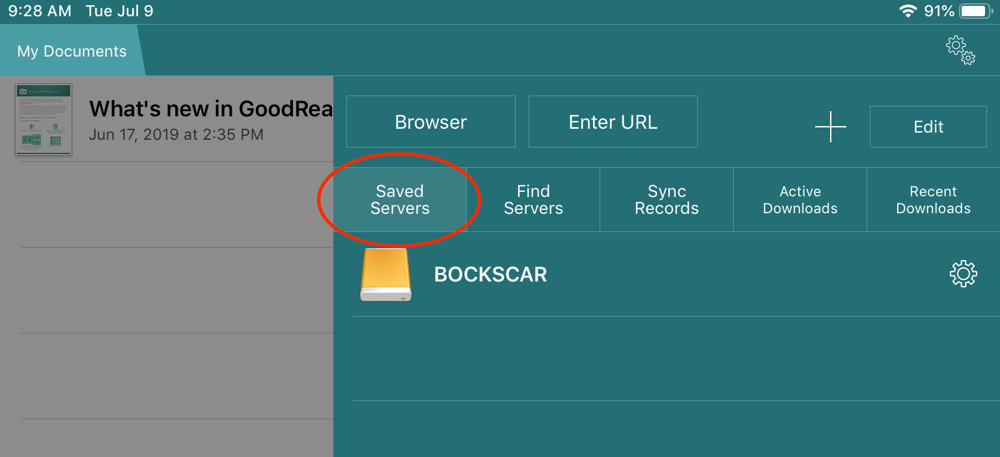
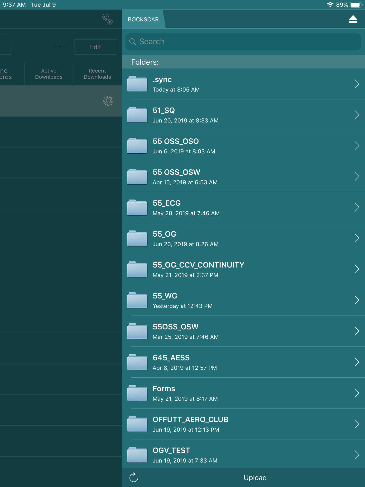
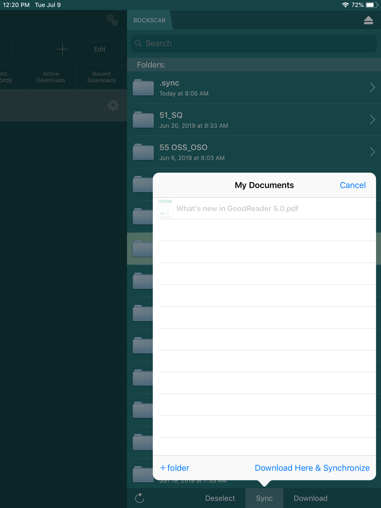
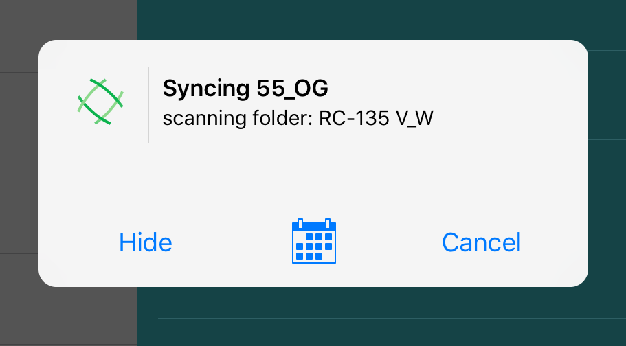

# Configure GoodReader to Sync Publications

Publications are Synced to your EFB using an application called GoodReader.

----

## Step 1: General App Settings

First, set up general settings in GoodReader.

 1. Tap the **Settings** button on the main screen. 
 

 2. Select the **General Settings** menu item.
 

 3. In **General Settings**, make the following changes:	
	 * Turn off Use `iCloud` folder
	 * Turn off Use `Downloads` folder
	 *  Make sure that `Disable device auto-lock` is on/enabled

----

## Step 2: Add the BOCKSCAR WebDAV server

 1. Tap the **Connect** button on the main screen. 
 

 2. Tap to highlight **Saved Servers**, then the plus sign `+`  to add a server.

 3. Select **WebDAV Server**.
 

 4. Configure the new **WebDAV Server** as follows:
	* Readable Title: `BOCKSCAR`
	* URL-address: `pubs.bockscar.mil`
	* Turn on/enable `Windows-style name encoding`
	* Turn off `Use cookies`
	* Leave all the other fields/settings unchanged

 5. Tap **Add**.

 6. You should now see **BOCKSCAR** listed as a saved server.
 

----

## Step 3: Sync a Folder

Now that you have the server added, we’ll need to configure GoodReader to sync with a folder on that server.

 1. Tap the Connect button on the main screen.  
 

 2. Tap to highlight Saved Servers.
 

 3. Select BOCKSCAR. A list of folders on the server are displayed.
  

 4. Tap to highlight the folder you’d like to sync (We want to select the folder, not see its contents. So tap the folder name, not the > to the right of it). 

	!!! Note 
		55 OG Aircrew should select the **55_OG** folder. If you’re unsure, that’s probably what you should select. You can come back anytime and sync additional folders.

 5. Tap **Sync**, at the bottom of the screen. 

 6. If you get a pop-up that says *Folder Already Exists* select **Proceed**.
 
 7. Now we’ll tell GoodReader where to sync the folder to on your device. We want the folder in your top/root directory, called **My Documents**, so do not select any folders. Tap **Download Here & Synchronize**.
 

 8. If you see a `Folder Already Exists` pop-up, tap **OK**.
 
 9. Configure the Sync Parameters as follows:
	* Turn on/enable **Download only** sync.
	* Make sure **Delete local files** is on/enabled
	* Turn on/enable **…even if they were edited**.
	* POLICY ON SYNC CONFLICTS: **Action** needs to be *Remote files have priority*.
	* Tap **Sync** (or **Close**)
 

10. You’ve set up the folder to sync from the BOCKSCAR server. GoodReader will now begin to sync that folder. You should see:
 

----

## Sync your Folders

Now that you’re set up, you can update your synced folders in GoodReader to make sure you have the latest publications/T.O.s/files.

1. Connect to a BOCKSCAR Wi-Fi Access Point.
 

2. Open GoodReader. From the main screen, tap the **Sync** button. 
 

----

## Failed Sync? 
 1. Make sure you’re connected to **BOCKSCAR** Wi-Fi.
 2. Turn **off** Airplane Mode.
 3. Turn **off** any VPNs. 
 4. Try again.

